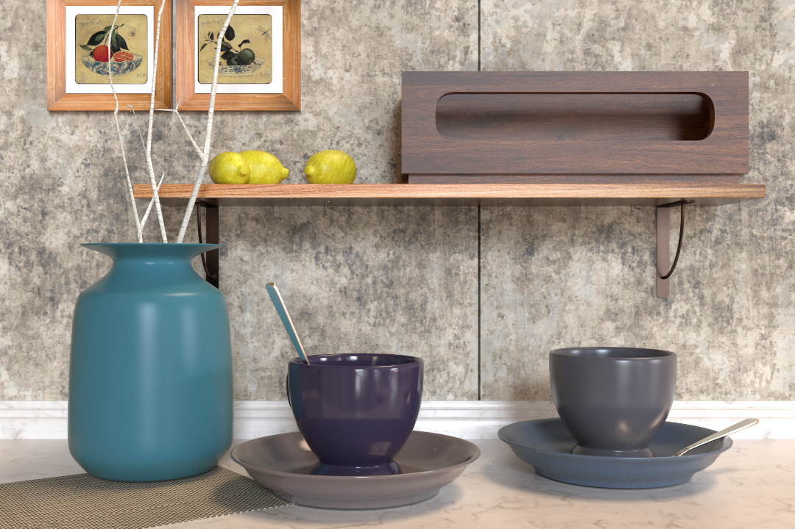

# 👋 Hi, I'm Yaoyi!

  <a href="https://express.adobe.com/page/AeW42ihuUwUTD">
    🌐 Homepage
  </a>

  

---

🎓 **Ph.D. Candidate**  
Computer Science @ UC Santa Barbara  

💡 Focus: **Computer Graphics, Neural Rendering, GPU Acceleration**

---

## 🚀 About Me

I work on **neural rendering systems and physically-based rendering**, with a strong focus on:

- GPU optimization & parallel computing  
- Neural representations for light transport and appearances
- Efficient rendering pipelines for production-quality results  

Most of my work sits at the intersection of **graphics + machine learning + systems** —  
where achieving SOTA performance often depends on **engineering efficiency on GPU**.

---

### 🔥 BRDF Importance Baking  
*Computer Graphics Forum (Accepted) · Eurographics 2026 (Talk)*

A method for accelerating **BRDF importance sampling** via precomputed and structured representations.

#### ✨ Key Idea
We propose to **bake BRDF importance distributions** into an efficient representation that can be queried at runtime, significantly reducing the cost of importance sampling in path tracing.

Instead of repeatedly evaluating complex BRDFs during rendering, we:

- Precompute importance distributions into a compact representation  
- Enable efficient runtime sampling via fast queries  
- Maintain high-quality rendering with fewer Monte Carlo samples  

#### 🚀 Contributions

- A novel **importance baking framework for general BRDF sampling**  
- Efficient **GPU-friendly querying mechanism**  
- Seamless integration with modern **path tracing pipelines**  

#### 📄 Status
Accepted to **Computer Graphics Forum (CGF)** and will be presented at **Eurographics 2026**.  

🎤 [Conference Program (Talk)](https://eg2026.github.io/program/#week_overview)

---

### 💡 Neural Complex Luminaires  
*SIGGRAPH 2021 (ACM TOG)*

This project introduces a **neural representation for complex luminaires**, enabling efficient rendering of challenging light transport scenarios.

#### ✨ Key Idea
We replace expensive light transport evaluation with **learned neural approximations**, enabling:

- Efficient evaluation at runtime  
- Seamless integration with path tracing + MIS  
- Significant reduction in storage & computation  

#### 🧠 Method Overview
We train **three neural networks** to handle:

- Radiance evaluation  
- Importance sampling  
- Visibility / transparency blending  

#### 📄 Abstract
Complex luminaires (e.g., chandeliers) are difficult to render due to refractive geometry and complex light paths.  
We compress their light fields into an implicit neural representation that integrates with standard rendering pipelines, achieving high-quality results with significantly reduced cost.

🔗 [Repo](https://github.com/VElysianP/Neural_Complex_Luminaire)  
📄 [Paper](https://dl.acm.org/doi/abs/10.1145/3450626.3459798)

---

### 🎨 Precomputed Dynamic Appearance  
*EGSR 2024*

A framework for **high-quality appearance interpolation** using optimal transport.

#### ✨ Key Idea
We avoid expensive runtime OT computation by:

- Precomputing appearance into a proxy distribution  
- Using a hierarchical query structure for fast retrieval  

#### 🚀 Contributions

- Efficient **multi-way barycentric interpolation**
- Supports **2D / 3D appearance blending**
- Works directly within rendering pipelines  

#### 📄 Abstract
We propose a precomputed representation that enables efficient appearance synthesis while preserving the high quality of optimal transport-based interpolation.

🔗 [Repo](https://github.com/VElysianP/Precomputed-Dynamic-Appearance-Synthesis-and-Rendering)  
📄 [Paper](https://diglib.eg.org/items/096e395f-7775-4b9d-800f-e4cd71ea7485)  
🎥 [EGSR Talk](https://www.youtube.com/watch?v=Qxmiwx9Da2g)

---

### 💇 Real-Time Human Hair Rendering Optimization  
*Tencent America · Photon Studio*

A real-time rendering framework for **efficient and high-quality human hair rendering** using OpenGL.

#### ✨ Key Contributions

- Implementation of multiple hair models:
  - **Kajiya-Kay** and **Marschner** shading models  
- Advanced visibility and lighting techniques:
  - **Shadow maps** and **deep opacity maps**  
  - **Dual scattering approximation** for realistic appearance  
- Optimization of **anti-aliasing for sub-pixel hair strands**  
- Improved performance for real-time rendering under heavy strand complexity  

#### 🧠 Context
Human hair rendering is challenging due to:

- Severe **aliasing** from sub-pixel strand geometry  
- High computational cost for **global illumination**  
- Complex **light scattering behavior**  

This project focuses on bridging **visual quality and real-time performance** in game rendering.

---

### 🎨 By-Example Appearance Synthesis with Optimal Transport  
*Facebook Reality Labs*

A framework for **appearance synthesis via optimal transport**, enabling natural interpolation across different data modalities.

#### ✨ Key Contributions

- Application of **optimal transport (OT)** for appearance synthesis  
- By-example interpolation for:
  - **2D textures**
  - **3D point clouds**  
- Demonstration of **natural and visually coherent blending** across distributions  

#### 🧠 Context
Optimal transport provides a powerful mathematical framework for interpolating between distributions.  
This project explores its use for **appearance synthesis**, serving as an early step toward scalable and efficient appearance modeling.

---
### 🫧 Bubble: AR Interface System  
*SIGGRAPH 2020 Appy Hour Talk · University of Pennsylvania*

**Methods, systems, and computer-readable media for extended reality user interfaces.**

An augmented reality (AR) interface system that organizes content as a hierarchy of **interactable nested bubbles**, enabling intuitive exploration and interaction in XR environments.

#### ✨ Key Contributions

- A hierarchical **bubble-based UI paradigm** for AR interaction  
- Support for diverse content types: **text, images, videos, and 3D assets**  
- Designed for natural interaction in **mixed reality environments**  

#### 📄 Context
Presented at **SIGGRAPH 2020 Appy Hour (University of Pennsylvania)**.

--- 

### 🧩 Simulating Elastic Materials with MPM  
*Material Point Method (MPM) Solver*

A physics-based simulation project modeling **elastic materials** under freefall and collision using an MPM solver.

#### ✨ Key Contributions

- Implementation of an **MPM-based simulation pipeline**  
- Simulation of **elastic deformation and collision dynamics**  
- Support for both **freefall and contact scenarios**  

#### 🧠 Context
The Material Point Method (MPM) is widely used for simulating **continuum materials** with complex deformation.  
This project focuses on elastic behavior under dynamic conditions.

#### 🛠️ Keywords
*(you can customize this section)*  
- Methods: MPM, continuum simulation, collision handling  
- Topics: physics-based animation, elastic materials  

#### 👥 Contributors
Dr. Joshuah Wolper, Dr. Ziyin Qu, Yaoyi Bai  

🎥 Demo: [Elastic Material Simulation (MPM)](https://www.youtube.com/watch?v=FlWyyqpLC5A)

---

### ❄️ Real-Time Snow Rendering in Cesium  
*Cesium · Vulkan / GPU Rendering*

A real-time snow rendering system for large-scale terrain visualization, built on **Cesium's terrain engine**.

#### ✨ Key Contributions

- Implementation of **real-time snow accumulation** using procedural methods (Perlin noise)  
- Integration with **Cesium terrain rendering pipeline**  
- Improved realism beyond texture-based approaches by introducing **depth-aware snow layering**  
- Designed as a framework for future **weather simulation effects**  

#### 🧠 Context
Traditional approaches add snow as a static texture, lacking depth and physical realism.  
This project introduces **dynamic snow accumulation** on terrain, enhancing visual fidelity in large-scale environments.

#### 🛠️ Keywords
- Graphics: real-time rendering, terrain rendering, procedural generation  
- GPU: Vulkan, GPU pipeline, parallel rendering  
- Methods: Perlin noise, height-based accumulation  

#### 👥 Contributors
Yaoyi Bai, Yuxin Hu, Dr. Anton Khabbaz  

🔗 [GitHub Repo](add link here)

--- 
### 🧬 Magic Offspring: Maya Shape Blending Plugin  
*Autodesk Maya · Geometry Processing / Content Generation*

A Maya plugin for **topology-aware shape blending**, enabling fast generation of novel 3D assets.

#### ✨ Key Contributions

- Implementation of a **shape blending system** based on topology-varying structures  
- Support for blending shapes with **different topology and geometry**  
- Integrated into **Maya workflow** for interactive content creation  
- Enables rapid generation of diverse assets (e.g., furniture, vehicles, robotics)  

#### 🧠 Context
Inspired by *Topology-Varying 3D Shape Creation via Structural Blending* (Alhashim et al.),  
this project focuses on making advanced geometry processing techniques **accessible in production tools**.

#### 🛠️ Keywords
- Graphics: geometry processing, shape interpolation, modeling  
- Tools: Maya plugin, MEL  
- Methods: structural blending, topology-varying shapes  

#### 👥 Contributors
Yaoyi Bai, Yuxin Hu  

---

## 📦 Resources

### 🖼 Mitsuba Scenes

A collection of high-quality **Mitsuba 0.5 rendering scenes**.

  

🔗 [GitHub Repo](https://github.com/VElysianP/mitsuba_scenes)

---

## 📫 Contact

Feel free to reach out for collaborations, research discussions, or opportunities!

🌐 [Homepage](https://express.adobe.com/page/AeW42ihuUwUTD)